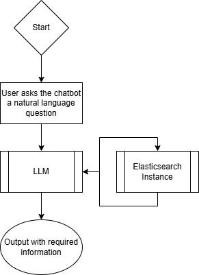
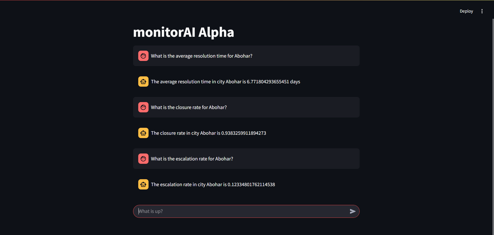

# monitorAI

## Links to prior material

[Concept Note](https://docs.google.com/document/d/1wKE7yjcyO35zAw9wqWCOOQBexn4U5taNeD8lVeHQXic/edit?tab=t.okuaud9kio42#heading=h.91zitcp1tpk) for the project, designed at the start of the project
[Presentation](https://docs.google.com/presentation/d/1E6m_o12gsyBmaehgIg3sI1eh9OMp05DCe_UpuhUnJRI/edit?usp=sharing) at the end of the internship, detailing current state and future work

## Design

The idea behind this project was to produce an LLM-based agent that would ease access to data for ULB employees. Below is a flowchart that describes the design.



A user puts in a query in natural language, which the LLM picks up. It decides which of the currently defined methods to access based on the query, runs the associated code (that will call the ES instance), processes the output as a string and returns it to the user. The whole application is wrapped in a basic Streamlit UI that allows it to appear as a chatbot. 



## Installation

You will need
- Python3, with pip installed
- OpenAI key
- Access credentials to the Elasticsearch server in question, along with the url of the server

Download the repo and install Python dependencies, including those for LangChain, Elasticsearch, and Streamlit.
```pip install -r requirements.txt```

In the `./.streamlit` folder, add a file called `secrets.toml`, which will contain the secret access tokens as needed by the app. A template is below.

```
ES_USER = <ES_USER>
ES_PASS = <ES_PASS>
OPENAI_API_KEY = <OPENAI_API_KEY>
```

Currently the Elasticsearch location is hardcoded, it will be good to place that also in the `secrets.toml`.

Now you can run the app using the following.
```streamlit run langchain_experiments.py```

Once it finishes setting up, it provides the link where it has opened the app (currently `localhost:8501`) and sets up again once the link is clicked.

## Usage

Usage is rather easy here, once the app is running, send in a natural language query on the app to get its response. Please note that currently it is limited to some archived data for the PGR module, which has been uploaded as structured data to the elasticsearch instance made for this app. 

## Limitations

- Currently the methods are designed for a single source of data uploaded as dummy data. It will be good to expand functionality to indices already in ES. At the moment, this will mean increasing the tools the LLM has access to, which is done manuallly. 
- Currently there are limited functions defined that the LLM can choose between, and sometimes they are sometimes confused by the model. Care will be needed in describing the tools for the LLM to parse.
- The choice of the model, the default OpenAI model, also disallows passing around large files, or indeed any output of a decent length. This severely limits the possibilities in terms of what kinds of questions can be useful. It will be necessary to find models that have a higher allowance and still work, or pay for increased allowance for OpenAI.
- There isn’t any sessioning at the moment, so that if the user closes the tab, all the messages are lost.
- Each message is independent of the others at the moment, as there is no memory yet. This also limits the flexibility of the questions the model can respond to.
- At the moment only the basic functionality testing has been completed. This will need a lot more kinds of tests.
- There are at the moment no guardrails in terms of accessing the internet. This can prove to be dangerous in terms of hallucinations.

## Future Work

- At the moment, a lot of work goes into building the tools that the agent is able to use. One way to bypass this labour is to have the LLM itself decide what code it should run. For this, there does not seem to be out-of-the-box functionality in LangChain, except when the Elasticsearch data has a very particular structure (this will be explained in the next section).
- For easier integration with DIGIT (or with modules that also integrate with DIGIT), one or more API endpoints will be useful. 
- Currently we are using models that need to be paid for, which is not ideal. There is some code commented out for integration with [HuggingFace](https://huggingface.co/) models in the file `langchain_experiments.py`, however, to run a powerful enough model will require cloud space. Further, the LangChain code might need to change if a HuggingFace model is used.
- Functionality to predict or suggest possible questions could be useful for a new user. 

## What has been tried

- The Memory module `ConversationBufferMemory` was tried, but it did not seem to work for this, though it has not been exhaustively tested.
- An attempt was made to test out the [PromptQL](https://hasura.io/promptql) platform that Hasura provides, but for lack of time, these tests could not be completed. In any case, both PromptQL and [RasaAI](https://rasa.com/) seem to work in a similar manner to what experiments we have run with [LangChain](https://www.langchain.com/langchain), which involve building out a range of tools for use by the LLM.
- An attempt was made at [this tutorial](https://python.langchain.com/docs/integrations/retrievers/self_query/elasticsearch_self_query/), however, this tutorial is designed for a very particular structure of the data. Theoretically, this method of using vectorstores would work to directly query the Elasticsearch instance without the need of tools, however, it is designed with text data in mind. Given records that are primarily a text document and its associated metadata, the LangChain code converts those documents to vectors that it will then perform similarity based searches on. It is not clear if such a method can be used for structured data that is the current dummy data, or the NoSQL documents that will exist on production. The attempt in `mirror.py` did not give very good results at all. Please note that `mirror.py` is not in an executable state, it is left in only for reference, and all sensitive information has been removed.