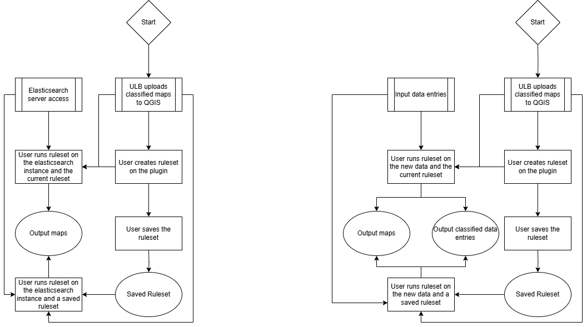
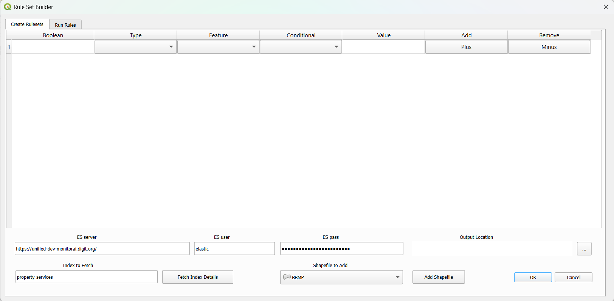
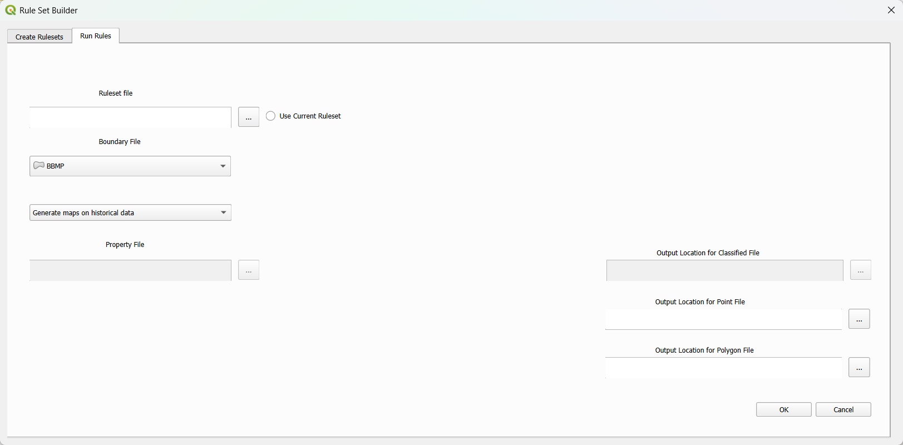
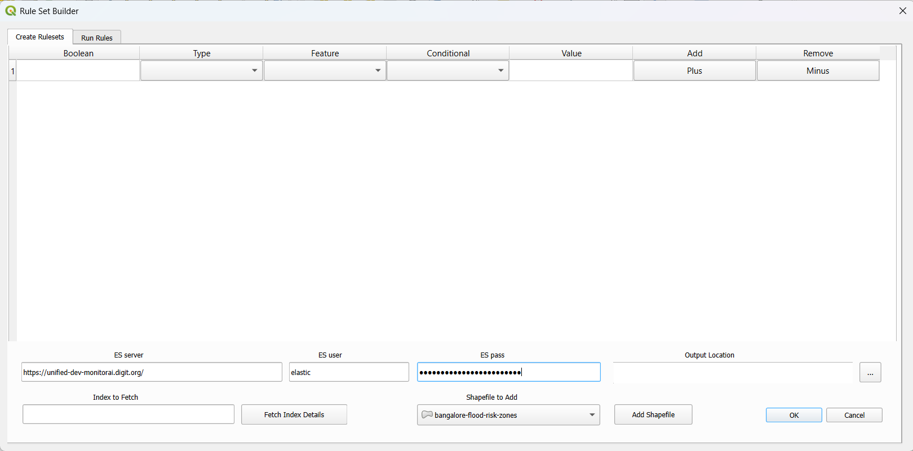
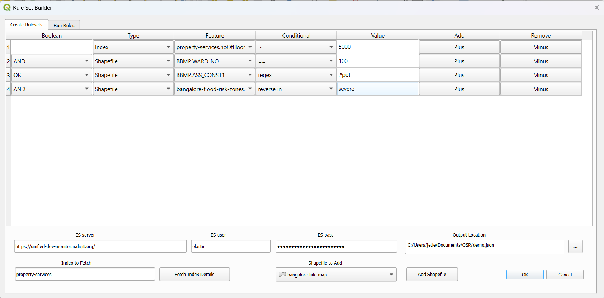
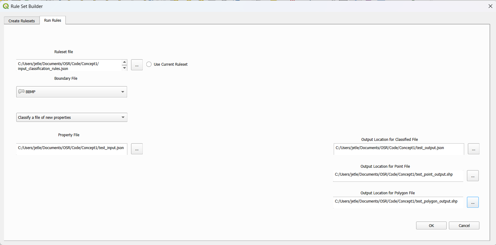

# Rule Set Builder

## Links to prior material

[Concept Note](https://docs.google.com/document/d/12tt-EvcoYBwY2MMMYrELt0-7JeMQ7qag91O7RA87ViQ/edit?usp=sharing) for the project, designed at the start of the project

[Presentation](https://docs.google.com/presentation/d/1E6m_o12gsyBmaehgIg3sI1eh9OMp05DCe_UpuhUnJRI/edit?usp=sharing) at the end of the internship, detailing current state and future work

## Design

This plugin is a device to ease visualizations and data management in cases where buildings need to be classified based on database information and map classifications. Below is a flowchart with the current device



A user first prepares the maps for their usecase, georeferencing, and classifying if need be. They then connect to the elasticsearch instance and begin to create rulesets for classification of the properties. Below is a screenshot of the first tab of the plugin, where ES connections are made, and rulesets are created



Pressing the plus and minus buttons controls the number of clauses in the ruleset, and each clause defines a data source and a function to run on it. At the moment only one ES index is allowed, whereas zero or more maps can be used. The ruleset is saved as a json file.



On this tab, the user can run the current ruleset, or a saved one, on historical data. The boundary map constrains search space for the packaged pincode map used for aggregations. This method generates two map files, one that assumes point information (geometric coordinates) exist within the data, and uses those to plot precise locations of buildings. The other generates aggregated maps based on pincode information observed to consistently exist in real data (as opposed to coordinate information), though naturally this is quite a bit less accurate. The rules can also be run on incoming data on this tab, where a json file of new data is returned with a new classification field based on the rules. 

### Hardcoding

At the moment there are a few assumptions hardcoded into the plugin. One is where within the structure of the ES document the coordinate or pincode information can be found. It is currently based on the mapping for the index property-services. The aattribute information that is saved to each point on the point map is also designed for property-services. The file format to receive and classify new data sticks to the ES output quite closely as well, which makes it inflexible.

### Ruleset creator design

This is a block of code that might need refining. At the moment, one index is allowed from ES as there is no out-of-the-box logic for joining two indices.The way by which two maps are joined is always intersection if one of the maps is an index, but when it is two shapefiles, the join method is decided by the join method provided on the first line of the ruleset where this shapefile appears. This is not clean, but it is something that can be changed in a short amount of time, though it will require changing the design of the interface.

### Strategy for aaggregation

A note on the aggregation strategy here, at the moment, this is splitting the classifications based on the data source. First the documents from ES are fetched which meet the requirements of the ruleset. These are then aggregated to give each pincode zone a count of buildings within it. At this point, it is currently finding an intersection between this pincode map and the map areas defined by the ruleset. Essentially, so long as there is the smallest intersection between the two for a pincode area, that whole pincode area is taken for the final map. It also keeps the aggregation value assigned to it across its area. It might be useful to at least add the area of intersection as a weighting for this number.

## Installation

You will need
- Access credentials to the Elasticsearch server in question, along with the url of the server
- QGIS 3.42

Within QGIS, go to the plugin manager, and add the following to the plugin repository list.

```https://github.com/egovernments/egov-rnd/rule_sset_builder/plugin_install_directory/plugins.xml```

With this, the plugin should be found in uninstalled plugins. Install it there. The plugin will appear on the plugins dropdown at the top. If it doesn't run because it throws an elasticsearch issue, open the inbuilt python console and install it there.

```pip install elasticsearch==8.17.1```

The version is specific to the version of ES running on the server, that might also cause issues related to ES while running the plugin. Once that is done, the plugin will be ready for use.

Installation location will be subject to change on testing.

## Usage

https://github.com/user-attachments/assets/779a9c43-24cf-4d23-ab2d-e948d5c3a266

### Initial setup

First the maps to be used are added to a project. Then the ES url and login information are added at the bottom of the first tab. This ES information is not saved if QGIS is closed.



### Creation of the rulesets

Indices are added bottom left with working ES information. Only one index can be active at any time. Shapefiles, specifically polygon shapefiles, are added bottom center. On the rule table, Type can be changed for any line at any point to Index or Shapefile, at which point it will allow setting rules based on that data source. Lines can be added and removed via the plus and minus buttons. The boolean column defines how rules are joined together, and also how data sources are, albeit rigidly (as discussed before). The ruleset can be saved by adding an output file bottom right. Hitting OK will save the file



### Running the rulesets

On the second tab, either ruleset file for use is found, or the currently defined ruleset on the previous tab can be used. A boundary file is picked to limit the search space in India to the pincodes in the city in question. Leaving the following dropdown on "Generate maps on historical data" will run the rulesets on the ES index and the maps defined. Switching it to "Classify a file of new properties" allows the addition of a new file which holds new input documents for the index. Running it now by hitting OK will generate a point output map and an aggregation output map as defined in previous sections. Adding output filenames on the right side of this tab will allow these maps to be saved on generation. Adding the output for the classified file will also save a json output that has the same information in the input file of new properties, except with a new field `_classification`. 



## Setting up for development

`Plugin Reloader` from the plugin manager will be necessary to be able to reload the plugin without reloading QGIS. `Qt Creator` from [this location](https://www.qt.io/product/development-tools) will be needed to change the `.ui` file, which has information on the UI. Once the plugin is installed via the steps in the installation section, it should be loaded unencrypted in the plugins directory. On Windows, this is in the AppData directory, at the following location.

```AppData\Roaming\QGIS\QGIS3\profiles\default\python\plugins```

All the main code is in `rule_set_builder.py`, while the UI design is in `rule_set_builder_dialog_base.ui`. At the moment there is a bug in the Qt Creator application that makes it so that every time the `.ui` file is saved, certain elements are written in a format that QGIS no longer supports. To fix this, replace `(Q\w+?)::\w+?::(\w+)` with `$1::$2` using regex replace on the file (as via VSCode's find and replace function). 

## Future Work

- A number of smaller changes have been suggested across this document
- An allowance can be made to edit saved ruleset files in the UI. As of now older rulesets can only be used. The format in which we are saving rulesets includes the intermediate mapping of these rules from the UI table. This can be used to go backwards to the table representation.
- An allowance can also be made to submit new properties via API and to process and return only the classification for that property. The method for new properties is clunky at the moment.
- Functionality can also be built in to present outputs of these rules as an interactive html file, using python package `geopython`. These can then be served on an API for better integration with DIGIT
- The most complex possibility is for users to be able to upload an image of a map, and for the plugin to convert that image to a georeferenced, partitioned and classified polygon map file. This will not be easy, and it may nnot even be possible at the moment.
