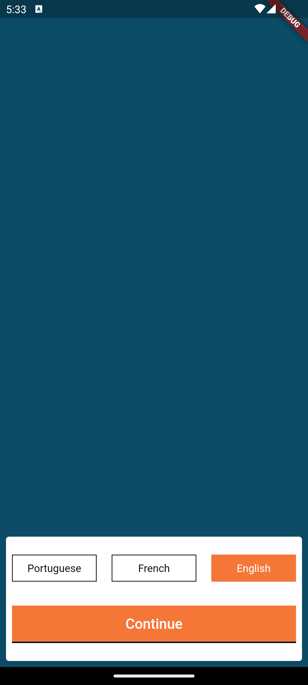
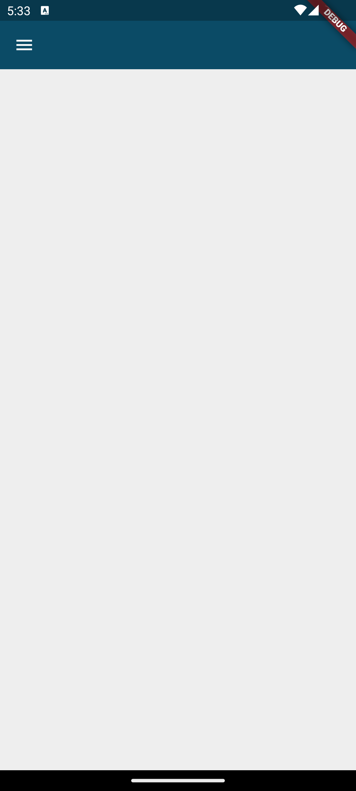
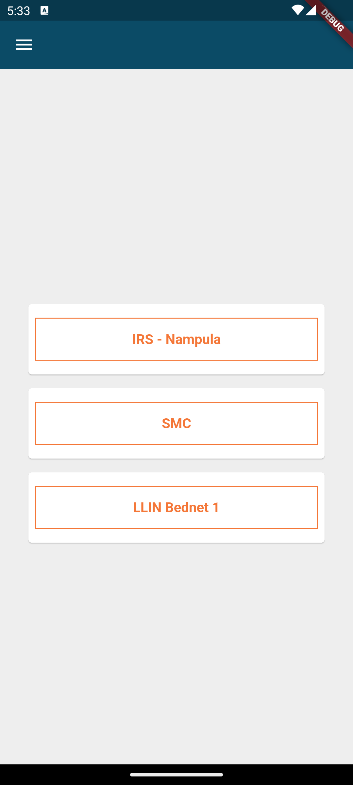
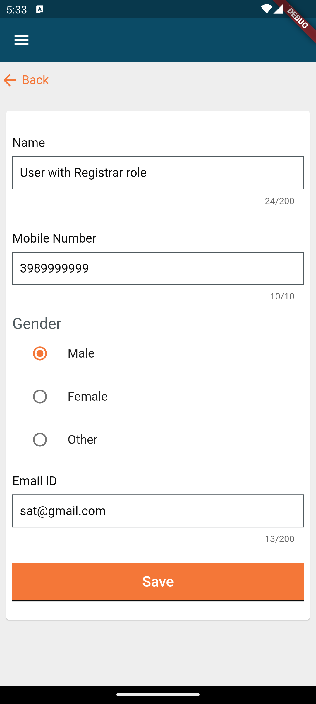
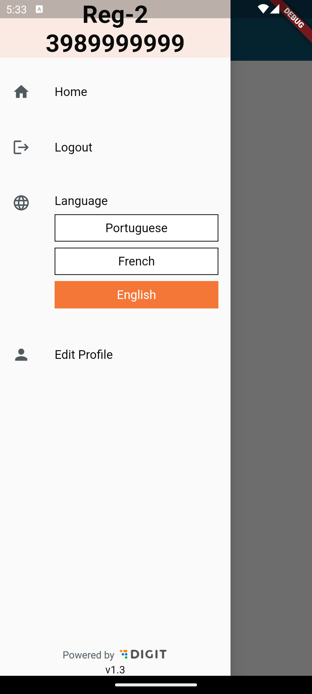

# Digit UI Starter Pack
Digit Starter Pack provides an easy way to test package integrations without having to build a new app every single time.

### Screens included in the starter pack
*Language Selection*  

*Login Page*  

*A Blank Home Screen*  

*Project Selection Screen*  

*Profile Screen*  

*A Drawer*  

### Features included 
1. **Localization**  
App language can be changed from any screen in the app using the sideBar. 

2. **Authentication**  
Form validation and auth token generation. Once the user logs in, she is logged in automatically when opening the app for the second time.

3. **Project Selection**  
Project has to be selected before going to the home page. ProjectId of the selected project is then made accessible elsewhere in the app for whatsoever purpose it may serve.

4. **Profile Display and Updation**  
User may choose to update their profile details.

5. **Secure Storage and ISAR**  
Stores offline so we do not have to make repeated API calls.

6. **Registry**  
Role-Action mappings and Service Registry are fetched for easy access to endpoints and can be used by the user on call everywhere in the app.

